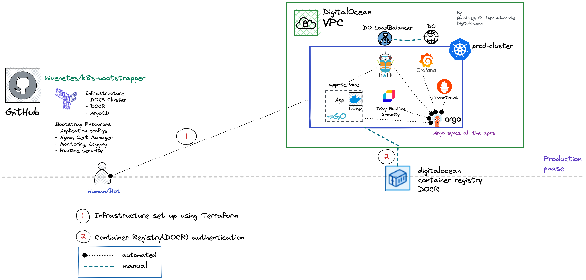

# Kubernetes Bootstrapper:  An extendable framework to set up production-grade clusters


Bootstrapping a Kubernetes cluster using Terraform and Argo CD, powered by DigitalOcean.

This framework aims to aid the [kubernetes adoption journey](https://try.digitalocean.com/kubernetes-adoption-journey/) of startups and SMBs. 

**Who is this for?**
- Kubernetes adopters
- SMBs who are looking to speed up the k8s adoption
- Builders and curious souls

## Prerequisites
- [terraform cli](https://learn.hashicorp.com/tutorials/terraform/install-cli)
- [doctl](https://docs.digitalocean.com/reference/doctl/how-to/install/)
- [kubectl](https://kubernetes.io/docs/tasks/tools/#kubectl)
- [DigitalOcean Cloud Account](https://cloud.digitalocean.com/)
- [DO Access Token (used by Terraform, DNS config)](https://docs.digitalocean.com/reference/api/create-personal-access-token/)
- [k9s (optional)](https://k9scli.io/topics/install/)

---
## Set up the infrastructure on DigitalOcean using Terraform 
The terraform module will create 
- DigitalOcean Kubernetes cluster[(DOKS)](https://docs.digitalocean.com/products/kubernetes/) 
- DigitalOcean Container Registry([DOCR](https://docs.digitalocean.com/products/container-registry/))
- Installs [ArgoCD Helm Chart](https://artifacthub.io/packages/helm/argo/argo-cd) on the DOKS cluster

```bash
git clone https://github.com/hivenetes/k8s-bootstrapper.git
cd infrastructure
# Initialise terraform modules
terraform init
# Copy the sample tfvars file
cp bootstrapper.tfvars.sample bootstrapper.tfvars
# Modify the `bootstrapper.tfvars` file 
# Example: `do_token=<your access token>`
terraform plan --var-file=bootstrapper.tfvars -out tf-bootstrapper.out
# To apply the infra plan
terraform apply "tf-bootstrapper.out" --auto-approve
# Once terraform has executed the plan, it will output the "cluster_id.”
# To update cluster credentials to kubeconfig and set up the current context run,
# Example: doctl kubernetes cluster kubeconfig save e74d2c45-c513-4c45-9ca3-f592ece1be76
doctl kubernetes cluster kubeconfig save <cluster-id>
```
### Authenticate with DigitalOcean Container Registry

Follow this [one-click guide](https://docs.digitalocean.com/products/container-registry/how-to/use-registry-docker-kubernetes/#kubernetes-integration) to integrate the registry with the Kubernetes cluster.

> **NOTE**:
Intended for experimentation/evaluation ONLY.
You will be responsible for all infrastructure costs incurred by the used resources.

---

## Argo CD: Declarative Continuous Delivery for Kubernetes

We have leveraged [Argo CD: App of Apps pattern](https://argo-cd.readthedocs.io/en/stable/operator-manual/cluster-bootstrapping/) to bootstrap the Kubernetes cluster.

```bash
# Get the argo password
kubectl -n argocd get secret argocd-initial-admin-secret -o jsonpath="{.data.password}" | base64 -d; echo
# Expose the argocd-server and login with the credentials on localhost:8080
kubectl -n argocd port-forward svc/argocd-server 8080:80
# Open the browser and go to localhost:8080 to access Argo CD UI
# Login with username: `admin,` password: `paste the value from the previous step.`
```
---
### DNS Setup for Argo CD (optional)
To access Argo CD via an FQDN, we need to configure a few things, 

**Prerequisites**
- A domain (example.com)
- [Personal Access Token](https://docs.digitalocean.com/reference/api/create-personal-access-token/) for [DigitalOcean DNS](https://docs.digitalocean.com/products/networking/dns/) access

```bash
# Disable internal TLS to avoid internal redirection loops from HTTP to HTTPS, the API server should be run with TLS disabled.
kubectl patch deployment -n argocd argocd-server --patch-file argocd/no-tls.yaml

# lets-encrypt-do-dns secret required for dns01 challenge
# @param access-token: DO access token 
kubectl create ns cert-manager && 
kubectl create -n cert-manager secret generic lets-encrypt-do-dns \
--from-literal=access-token=<insert DO access token> 
```

---
## Let the bootstrap begin

Check out [this doc](./bootstrap/README.md) for more details on app configurations and the boostrap process.

```bash
# Install industry-standard open-source tools to build a production-grade k8s stack
kubectl apply -f https://raw.githubusercontent.com/hivenetes/k8s-bootstrapper/main/bootstrap/bootstrap.yaml
# **_NOTE:_**  One can login to ArgoCD UI to monitor the bootstrapped cluster
```

### Overview of the bootstrapped cluster



## Tear down the Bootstrapped cluster

```bash
# Simply run
cd infrastructure
terraform destroy --var-file=bootstrapper.tfvars --auto-approve
# Bye Bye !!
```

## Media/Demos
- [Blog: Build your own K8s framework](https://thecloudodyssey.com/build-your-own-kubernetes-framework)
- [Workshop: DigitalOcean Deploy Conference 2022](https://youtu.be/PfoB2e95VjQ)

### Shoutout
This project takes inspiration from the fantastic work done by [Alex Jones](https://twitter.com/AlexJonesax) of [Cloud Native Skunkworks.](https://www.cloudnativeskunkworks.io/)
